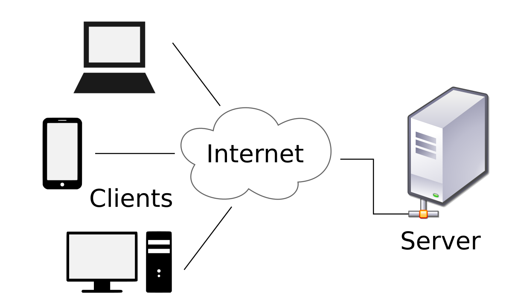

# <p align="center">SWE4103 Project (To Be Named)</p>

<p align="center"><- We can come up with a fun product name if you guys want -></p>
<p align="center"><- Logo when we have one -></p>
<p align="center">A Development Team Dashboard, specifically suited for student team projects, to track team and team member productivity, and sentiment as they move through a course project. 
(More details to be added as feature are implemented)</p>

## 🧭 Table of Contents

- [SWE4103 Project](#swe4103-project)
  - [Team](#-team)
  - [Technologies](#-technologies)
    - [Frontend](#frontend)
    - [Backend](#backend)
    - [Development & Quality Tools](#development--quality-tools)
    - [Deployment & Operations](#deployment--operations)
  - [Architecture](#-architecture)
  - [Directory Structure](#-directory-structure)
  - [Contributing](#-contributing)
  - [Local Run](#-local-run)
    - [Prerequisites](#prerequisites)
      - [Windows](#windows)
      - [macOS](#macos)
    - [Steps](#steps)

## 👥 Team

| Name                  | Roles                                             | Responsibilities                                                                                                                              |
| --------------------- | ------------------------------------------------- | --------------------------------------------------------------------------------------------------------------------------------------------- |
| **Jacob Pembleton**   | Product Owner                                     | Defining product vision, managing the backlog, prioritizing features                                                                          |
| **Micheal Bridgland** | Scrum Master                                      | Facilitating Scrum process, ensuring adherence to Agile principles                                                                            |
| **Aiden Foster**      | Lead Developer                                    | Compiling documentation, answering questions, developing features                                                                             |
| **Alex Groom**        | Lead Developer                                    | Compiling documentation, answering questions, developing features                                                                             |
| **Eric Cuenat**       | Lead Developer, DevOps Engineer                   | Compiling documentation, answering questions, developing features, Building CICD pipeline and facilitating cloud architecture                 |
| **Matthew Collett**   | Lead Developer, DevOps Engineer                   | Compiling documentation, answering questions, developing features, Building CICD pipeline and facilitating cloud architecture                 |
| **Lucas Savoie**      | Developer, Integration Testing                    | Contributing documentation, developing features, fixing bugs, building test suites, validating unit tests                                     |
| **Jonathan Eddie**    | Developer, Integration Testing, Assurance Testing | Contributing documentation, developing features, fixing bugs, feature validation, demonstrations, building test suites, validating unit tests |
| **Lin Samman**        | Developer                                         | Contributing documentation, developing features, fixing bugs                                                                                  |
| **Gopika Shrivastav** | Developer                                         | Contributing documentation, developing features, fixing bugs                                                                                  |
| **Pierre Mebande**    | Developer                                         | Contributing documentation, developing features, fixing bugs                                                                                  |

## 📚 Technologies

- [**Node.js**](https://nodejs.org/en)
  - JavaScript runtime environment

### Frontend

- [**React.js**](https://react.dev/)
  - Frontend JavaScript library
- [**Bootstrap**](https://getbootstrap.com/)
  - CSS framework

### Backend

- [**Express.js**](https://expressjs.com/)
  - Backend web application framework
- [**SQLite**](https://www.sqlite.org/)
  - Embedded on-disk SQL database engine

### Development & Quality Tools

- [**ESLint**](https://eslint.org/)
  - JavaScript linting tool
- [**Prettier**](https://prettier.io/)
  - Opinionated code formatter
- [**Husky**](https://typicode.github.io/husky/)
  - Git hook manager
- [**Yarn**](https://yarnpkg.com/)
  - JavaScript package manager

### Deployment & Operations

- [**Docker**](https://www.docker.com/)
  - Container service provider for developing, shipping, and running applications
- [**CircleCI**](https://circleci.com/)
  - Continuous integration and continuous delivery platform
- [**Amazon Web Services (AWS)**](https://aws.amazon.com/)
  - Cloud service provider

## 🛠️ Architecture

This project follows a 2-tier **(this may change to 3-tier if we ever decide to migrate to a cloud hosted DB)** client-server architecture, where the React frontend handles the user interface and communicates with the Express backend API to manage data and server-side logic, ensuring a clear separation between the presentation and application layers.

<p align="center"></p>

## 🏗️ Directory Structure

- `.circleci/`
  - CircleCI config
- `.github/`
  - GitHub related config. For example the pull request template. If we end up using any GitHub Actions, they will also live in here.
- `.husky`
  - Husky config for pre-commit hooks
- `api/`
  - Backend Express.js API Server. Created following [How to structure an Express.js REST API with best practices](https://blog.treblle.com/egergr/)
  - `app/`
    - Application code for server
    - `controllers/`
      - The methods that process an endpoint and unpack web layer data to dispatch to services
    - `middleware/`
      - Reusable plugins to modify requests typically used for cache control, authentication, error handling, etc.
    - `routes/`
      - Declares the path of API endpoints and assigns to controllers
    - `services/`
      - Handles business logic and interacts with data sources or external APIs (like our database)
    - `index.js`
      - Configuration and setup for server
  - `spec/`
    - `openapi.yaml`
      - OpenAPI specification for API design
  - `.dockerignore`
    - Files or directories that Docker ignores
  - `app.js`
    - Entry point of the server
  - `Dockerfile`
    - Build instructions for Docker image
  - `package.json`
    - API level package.json file
    - Specific to the `api` component of the project
    - Specific to Node.js and JavaScript projects, used to manage dependencies, scripts, and project metadata for `api`
- `assets/`
  - Global static assets like images
  - `docs/`
    - Assets related to documentation
- `client/`
  - TODO
- `scripts/`
  - Scripts for operations related to CI/CD pipeline
- `eslintrc.json`
  - ESLint config
- `.gitignore`
  - Files or directories that git ignores
- `prettierrc.json`
  - Prettier config
- `package.json`
  - Root level package.json file
  - Specific to Node.js and JavaScript projects, used to manage dependencies, scripts, and project metadata
  - Uses yarn workspaces and created following [Yarn Workspaces: Organize Your Project’s Codebase Like A Pro](https://www.smashingmagazine.com/2019/07/yarn-workspaces-organize-project-codebase-pro/)
- `README.md`
  - This :-)
- `yarn.lock`
  - Created by Yarn to ensure consistent dependency versions across environments

## ⛑️ Contributing

When making changes in this project, whether new features or bug fixes, the workflow should resemble the following.

**Note:** If you use a UI tool for git like GitHub Desktop, feel free to keep using it and loosely follow the below steps.

1. Checkout the main branch

```bash
git checkout main
```

2. Pull the latest changest from the main branch

```bash
git pull origin main
```

3. Create your new branch that you will work on. Use `feat` for a new feature, or `fix` for a bug fix. `SCRUM-#` should correspond with the Jira ticket number you are working off of.

```bash
git checkout -b feat|fix-SCRUM-#
```

4. After you are satisfied with your changes, add the changes to your local staging area

```bash
git add <files-to-add>
```

5. Commit your changes with a short, informative commit message. Please prefix it with `feat` or `fix` like your branch name, and your Jira identifier in brackets

```bash
git commit -m "feat|fix(SCRUM-#): Example message"
```

6. Finally, push your changes to your remote branch

```bash
git push origin <branch-name>
```

A full example is shown below for clarity:

```bash
git checkout main
git pull origin main
git checkout -b feat-SCRUM-1

... make changes ...

git add newfile.txt
git commit -m "feat(SCRUM-1): Add new text file"
git push origin feat-SCRUM-1
```

7. After you do this, you should be able to go to our repository on GitHub, and create a new Pull Request that can be reviewed by other team members and eventually merged into the main branch

8. Once you have created the Pull Request, you will notice a template is present in the description field. Please fill out this template so team members can review your PR with ease.

## 🚀 Local Run

### Prerequisites

- **Node.js** (v14 or higher) and **Yarn** must be installed on your machine. You can verify if you have these by running the following commands

```bash
node -v
yarn -v
```

#### Windows

- You can download Node.js from the official [Node.js website](https://nodejs.org/en)
- After installing Node.js, install Yarn by running

```bash
npm install -g yarn
```

#### macOS

- On macOS, you can install Node.js via Homebrew

```bash
brew install node
```

- To install Yarn, also use Homebrew

```bash
brew install yarn
```

- If you do not have Homebrew on your mac, I would highly recommend installing it [here](https://brew.sh/).

### Steps

1. First, start by cloning this repository to your local machine

```bash
git clone https://github.com/swe4103/swe4103-project.git
```

2. Navigate into the project directory

```bash
cd swe4103-project
```

3. Install the necessary dependencies

```bash
yarn install
```

4. At this point, you can run either just the client (frontend React.js application), just run the server (backend Express.js API), or you can run them concurrently, communicating with eachother

**Client**

```bash
yarn client
```

Client application should be running at `http://localhost:????`

**Server (API)**

```bash
yarn api
```

API server application should be running at `http://localhost:3000`

**Both**

```bash
yarn dev
```

This will run both the client and the API server concurrently communicating with eachother in the foreground.
