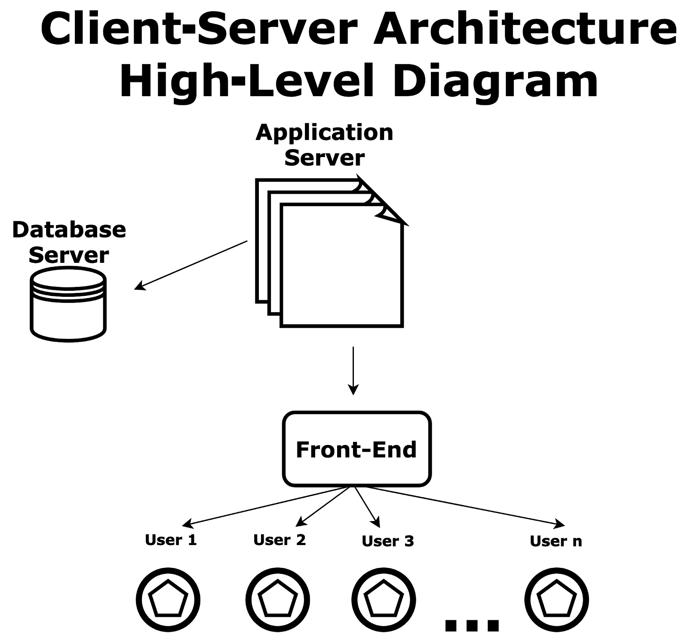

# Technologies & Architecture

This document outlines the technolgies used in this project, and the underlying architecture in which it is built upon.

## Technologies

- [**Node.js**](https://nodejs.org/en)
  - JavaScript runtime environment

### Frontend

- [**React.js**](https://react.dev/)
  - Frontend JavaScript library
- [**Bootstrap**](https://getbootstrap.com/)
  - CSS framework
  - Documentation on how it was setup within the app https://getbootstrap.com/docs/5.2/getting-started/vite/

### Backend

- [**Express.js**](https://expressjs.com/)
  - Backend web application framework
- [**Cosmos DB**](https://azure.microsoft.com/en-us/products/cosmos-db)
  - NoSQL cloud database

### Development & Quality Tools

- [**ESLint**](https://eslint.org/)
  - JavaScript linting tool
- [**Prettier**](https://prettier.io/)
  - Opinionated code formatter
- [**Husky**](https://typicode.github.io/husky/)
  - Git hook manager
- [**Yarn**](https://yarnpkg.com/)
  - JavaScript package manager

### Deployment & Operations

- [**Docker**](https://www.docker.com/)
  - Container service provider for developing, shipping, and running applications
- [**Docker Compose**](https://docs.docker.com/compose/)
  - Tool for defining and running multi-container applications
- [**CircleCI**](https://circleci.com/)
  - Continuous integration and continuous delivery platform
- [**Amazon Web Services (AWS)**](https://aws.amazon.com/)
  - Amazon cloud service provider
- [**Microsoft Azure**](https://azure.microsoft.com/en-ca)
  - Microsoft cloud service provider

## Architecture

This project follows a mono-repo 3-tier client-server architecture. The React frontend handles the user interface and communicates with the Express backend API to manage data and server-side logic. This ensures a clear separation between the presentation and application layers within a single repository.

